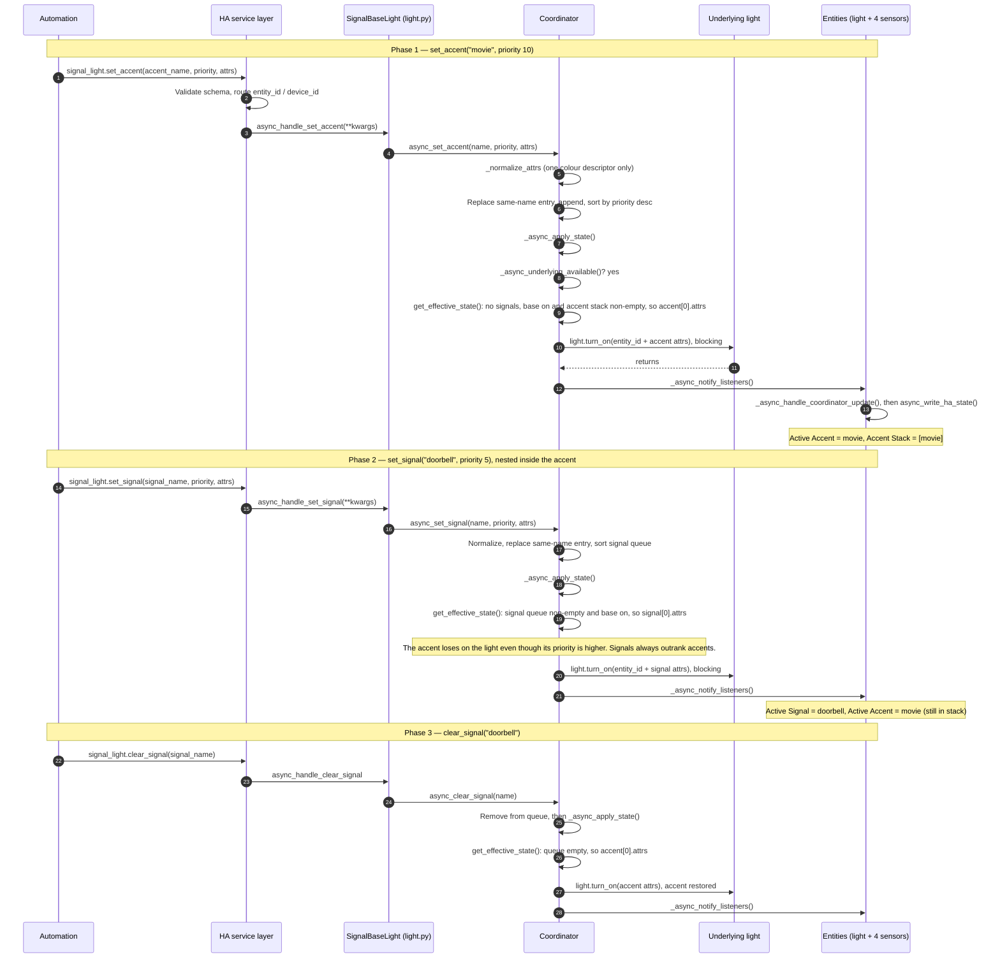
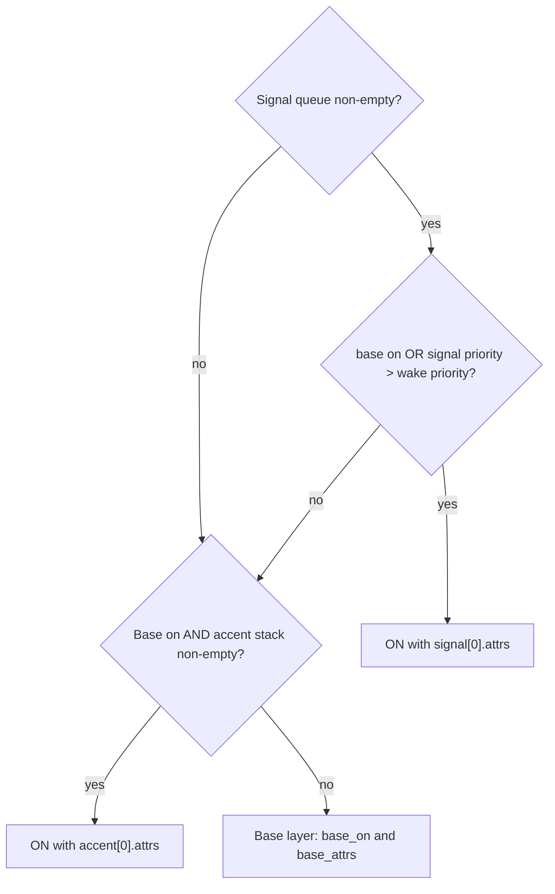

# Event flow: accent, then a nested signal

Flow of events through the integration when an accent is applied and a signal
is then set on top of it. Assumes the base layer is **on** and the underlying
light is available. Code references are to `custom_components/signal_light/`.

## Sequence

## Layer evaluation

`SignalLightCoordinator.get_effective_state()` runs top-down on every apply:

## Notes

- **Two kinds of priority:** signal and accent priorities are never compared
  against each other. The signal queue is checked first, so any active signal
  beats any accent. Priority only orders entries within a layer.
- **Wake priority:** if the base layer is **off**, a signal only lights the
  light when its priority is above `signal_wake_priority`. Accents never wake
  an off light, because they require the base layer to be on.
- **Order of side effects:** the physical light is updated first, with
  `blocking=True`. Listeners are notified afterwards, so entity and sensor
  states change only once the hardware call returns.
- **Unavailable light:** if the underlying light is unavailable,
  `_async_apply_state` returns early. Layers are still updated and listeners
  still fire; the apply is retried when
  `_async_handle_underlying_state_change` sees the light become available.
- **Persistence:** accent and signal layers are in-memory only and are not
  restored across a Home Assistant restart.
